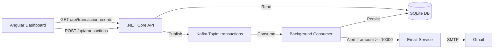

# Transaction Alert Service

An event-driven transaction monitoring system built with .NET Core, Apache Kafka, and Angular. Accepts financial transactions via a REST API, processes them asynchronously through a Kafka pipeline, persists them to a database, and sends real-time email alerts when transactions breach a configurable threshold.

---

## Architecture



---

## Tech Stack

| Layer | Technology |
|---|---|
| Frontend | Angular, TypeScript |
| Backend API | .NET Core 9, ASP.NET Web API |
| Messaging | Apache Kafka |
| Database | SQLite + Entity Framework Core |
| Email | MailKit, Gmail SMTP |
| Infrastructure | Docker, Docker Compose |

---

## How It Works

1. **Submit a transaction** via the Angular dashboard or REST API
2. The API publishes the transaction as a Kafka message to the `transactions` topic
3. The background consumer picks it up, evaluates the amount against the alert threshold (₹10,000)
4. The transaction is persisted to SQLite regardless of amount
5. If the threshold is breached, an email alert is dispatched to the configured recipient
6. The Angular dashboard polls the transaction history endpoint and displays all records with alert status

---

## Project Structure

```
transaction-alert/
├── TransactionAlert.API/           # REST API — accepts transactions, exposes history
│   ├── Controllers/
│   │   ├── TransactionsController.cs       # POST /api/transactions
│   │   └── TransactionRecordsController.cs # GET /api/transactionrecords
│   └── Services/
│       └── KafkaProducerService.cs
├── TransactionAlert.Consumer/      # Background worker — Kafka consumer + email alerts
│   ├── TransactionConsumerWorker.cs
│   ├── EmailService.cs
│   └── TransactionDbContext.cs
├── TransactionAlert.Shared/        # Shared models
│   ├── Transaction.cs
│   └── TransactionRecord.cs
├── transaction-alert-dashboard/    # Angular frontend
│   └── src/app/
│       ├── app.component.ts
│       ├── app.component.html
│       └── services/transaction.service.ts
└── docker-compose.yml              # Kafka + Zookeeper
```

---

## Getting Started

### Prerequisites

- [.NET 9 SDK](https://dotnet.microsoft.com/download)
- [Docker](https://www.docker.com/)
- [Node.js + Angular CLI](https://angular.io/cli)
- A Gmail account with [App Password](https://support.google.com/accounts/answer/185833) enabled

### 1. Start Kafka

```bash
docker-compose up -d
```

### 2. Create the Kafka topic

```bash
docker exec -it transaction-alert-kafka-1 kafka-topics \
  --create --topic transactions \
  --bootstrap-server localhost:9092 \
  --partitions 1 --replication-factor 1
```

### 3. Configure email credentials

Open `TransactionAlert.Consumer/appsettings.json` and fill in:

```json
"Email": {
  "From": "your-email@gmail.com",
  "AppPassword": "your-app-password",
  "AlertRecipient": "your-email@gmail.com"
}
```

### 4. Run the Consumer

```bash
dotnet run --project TransactionAlert.Consumer
```

### 5. Run the API

```bash
dotnet run --project TransactionAlert.API
```

### 6. Run the Angular Dashboard

```bash
cd transaction-alert-dashboard
ng serve
```

Open [http://localhost:4200](http://localhost:4200)

---

## API Reference

### POST `/api/transactions`

Submit a new transaction.

**Request body:**
```json
{
  "fromAccount": "ACC-001",
  "toAccount": "ACC-002",
  "amount": 15000,
  "currency": "INR"
}
```

**Response:**
```json
{
  "message": "Transaction received",
  "transactionId": "c4233f2f-1332-487e-92c5-786a4d9da0eb"
}
```

### GET `/api/transactionrecords`

Returns all persisted transactions ordered by timestamp descending.

**Response:**
```json
[
  {
    "id": "c4233f2f-1332-487e-92c5-786a4d9da0eb",
    "fromAccount": "ACC-001",
    "toAccount": "ACC-002",
    "amount": 15000.0,
    "currency": "INR",
    "timestamp": "2026-04-28T07:24:52.730471",
    "alertTriggered": true
  }
]
```

---

## Configuration

| Key | Location | Description |
|---|---|---|
| `Kafka:BootstrapServers` | API + Consumer `appsettings.json` | Kafka broker address |
| `Email:From` | Consumer `appsettings.json` | Gmail sender address |
| `Email:AppPassword` | Consumer `appsettings.json` | Gmail App Password |
| `Email:AlertRecipient` | Consumer `appsettings.json` | Alert email recipient |
| `AlertThreshold` | `TransactionConsumerWorker.cs` | Amount above which alerts fire (default: 10000) |

---

## Alert Email Sample

```
Transaction Alert

Transaction ID : c4233f2f-1332-487e-92c5-786a4d9da0eb
From Account   : ACC-001
To Account     : ACC-002
Amount         : 15000 INR
Timestamp      : 28/04/2026 07:24:52

This transaction exceeded the alert threshold of 10000 INR.
```